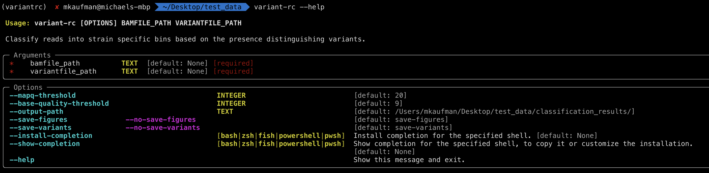
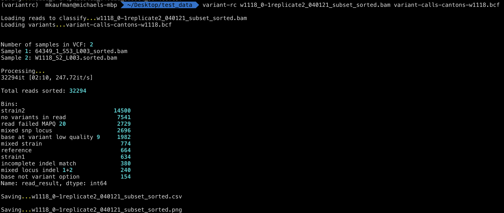

# variant-rc: Variant Read Classification

Tool to classify aligned sequencing reads into bins based upon distinguishing variants (SNPs and Indels) found in parental sequences.

Requirements for classification of sequencing reads:

* VCF/BCF file - variants between two or more references
* BAM file - aligned reads to be sorted
* Indexs for files above (generated with bcftools, samtools, etc)

## Installation

Requires: Python >=3.8, pip or pipx

The prefered method of installation into an isolated python enviroment using pipx:
(<https://pypa.github.io/pipx/>)

**Using pipx:**

Install pipx if necessary:

`pip install pipx  # install pipx if unavailable`

use pipx to install directly from this github repo:

`pipx install git+https://github.com/rnabioco/variant-rc.git`

**Using vanilla pip:**

`pip install git+https://github.com/rnabioco/variant-rc.git`

**Notes:**

Installation creates a systemwide `variant-rc` command.

`variant-rc --help`

## Usage

Command Arguments:

`variant-rc --help`

Read Classification:

`variant-rc <bamfile> <vcf-file>`

## Outputs

Variant-RC currently outputs two formats:

* Dataframe containing all read level information as a CSV file
* PNG plot of classification results
